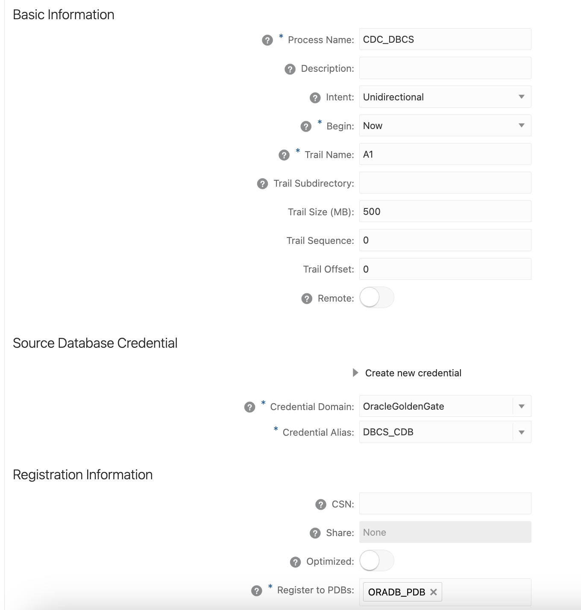

In this example we have a goal to replicate data from Oracle DB 19c into Google BigQuery using Stage and Merge method. All the setup will be connected in a private subnet. 
I am mentioning specifically Stage and Merge, because there are actually 2 ways: 
 - Stage and Merge BigQuery event handler
 - BigQuery handler
Differences between both of them could be found here: [Oracle GoldenGate for Big Data](https://docs.oracle.com/en/middleware/goldengate/big-data/21.1/gadbd/using-google-bigquery-event-handler.html#GUID-ACFC0A1A-FBFD-4439-AB50-EB2976D5A828)
However, what should be remembered here is that Stage and Merge handler uses Google Storage as a staging location and only after that loads data into BigQuery. It comes with some delay during replication, however it is way cheaper than using BigQuery handler.

What are the pre-requisites here:
1) Source. We will use Oracle DB 19c. Create a schema C##GGADMIN in container db and assign privileges using the code below.

ALTER SYSTEM SET ENABLE_GOLDENGATE_REPLICATION=TRUE SCOPE=BOTH;
CREATE USER C##ggadmin IDENTIFIED BY "password" container=all;
GRANT CREATE SESSION,CONNECT,RESOURCE,ALTER SYSTEM TO C##ggadmin container=all;
GRANT ALTER ANY TABLE TO c##ggadmin container=all;
GRANT SELECT ANY TABLE TO c##ggadmin container=all;
GRANT DBA TO c##ggadmin container=all;
GRANT EXECUTE ON DBMS_FLASHBACK TO c##ggadmin container=all;
GRANT SELECT ANY DICTIONARY, FLASHBACK ANY TABLE  TO c##ggadmin container=all;
ALTER USER  C##ggadmin DEFAULT ROLE ALL container=all;
EXEC DBMS_GOLDENGATE_AUTH.GRANT_ADMIN_PRIVILEGE('C##ggadmin', container=>'all');

2) OCI GoldenGate for Oracle Databases provisioned
3) GolgenGate for BigData deployed from Marketplace (OCI GoldenGate does not support BigQuery yet)
4) BigQery prepared. Please, check permissions to match the ones required from the documentation [Oracle GoldenGate for Big Data](https://docs.oracle.com/en/middleware/goldengate/big-data/21.1/gadbd/using-google-bigquery-event-handler.html#GUID-8CD78EDB-2BC1-430C-A322-A008021B8DBD)
5) In our case BigQuery is publicly available, so a NAT Gateway was configured to allow traffic to flow to Internet only and not vice-versa.

In my example, I will be using DBCS (Database Cloud Service) named **ORADB** **with Pluggable Database named **ORADB_PDB.**

## Step 1: Prepare OCI Goldengate for Oracle

Let's create a connection to our Oracle DB 19c and attach it to our OCI GoldenGate deployment.
Go to the *Menu* => *Oracle Database* => *GoldenGate*.
Once the Overview page is opened, navigate to Connections and click **Create Connection.** 
*Note*: Create a connection using **C##GGADMIN** from Pre-Requisites section.
Once you filled in all required information for connectivity, click Create. Once the connection is created you should see status **Active**. 

Once you have it created, it's time to attach it to our deployment. 
Go to GoldenGate => Deployments and navigate to your GoldenGate deployment. In my scenario it is called *OGG Oracle DB*. At the bottom of the page in Resources panel, select **Assigned Connections** and Click on **Assign Connection**.

Once the connection is attached, you should see the ***State*** will change to **Active**.

Now, let's navigate to this deployment and create Extracts.
To access our deployment that is in private subnet, I will create a Bastion Session, to access it from a public one: Menu => Identity&Security => Bastion => Create Bastion

Fill in the information required as per my example. For CIDR bloc allowlist I used 0.0.0.0/0 as an example, however for a better security I recommend using a proper CIDR block. 
Click **Create Bastion**.

Once the Bastion is created - access it. At the bottom of the page you will see Create Session. Click on it and fill in the details for Session type:  **SSH Port forwarding session***
My IP address of the deployment is 10.0.1.28. You could find it in the GoldenGate deployment details. Click **Create Session.**

Once the Session is created, it will change status to **Active**.
Click on Action button and select **Copy SSH Command.** Paste it in a terminal. Change *privatekey* with private key directory and *local port *with 8080. You will be accessing localhost:8080 and this will be forwarded to GG's 443.

You should have similar result:

Open a browser and navigate to ***localhost:8080***. Enter oggadmin credentials.
Now, what will we do is to:
- Create Integrated Extract to capture CDC
- Get SCN from our DB
- Create Initial Load Extract

*Note*: If in GoldenGate connections, you created a connection the DBCS using selecting a source from the list, it will create directly a connection to the PDB. What we want is to have a connection to the CDB as well.

To achieve that, in GoldenGate page that you opened, navigate to Menu => Configuration. You see one single Connection similar to that. Click on Copy Credentials button. 

Copy ***USER ID*** in a text editor and replace ***SERVICE_NAME*** value with a CDB Service name. 
Once done, test it using button ***Connect to database***. You should see TRANDATA Information available only. 

In Trandata Information, click on + button to add schema or table. If you select Schema, the format should be as follows: ***PDB_name.Schema_name***. 
Enable ***All Columns*** as well. ***Click Submit***

You could check your actins by placing PDB_Name;* in the search bar with Schema name enabled. It will search for all schemas available for replication and will display number of tables inside. 

Now, let's create our Extracts.
From **Menu** navigate to **Overview** and click on **+** button to create a new extract. Select **Integrated Extract ** and click **Next**.

Populate the fields:
Process Name: **CDC_DBCS**
Trail Name: **A1**
Credential Domain: **OracleGoldenGate**
Credential Alis: **DBCS_CDB** (provide CDB connection name that you created in Configuration. If you didn't change it, it was named: **DBCS_Copy**)
Register to PDBs: select **your PDB** from the list. 

You should have similar values as in my screenshot. 

Click on ***Next*** to move to the Parameter File.

Add the following line: `Table ORADB_PDB.DEMO.YOUR_TABLE_NAME;`
You should have a similar view.

Once Done, Click on **Create and Run**. You should have a similar output.

Now, before creating Initial Load extract we need to get the SCN number from the database. Use the script from below, presented by Alex Lima in his blog. 
https://blogs.oracle.com/dataintegration/post/goldengate-microservices-initial-load-instantiation-with-webui

`Select T.START_SCN, T.STATUS TSTATUS, T.START_DATE, S.SID, S.SERIAL#, S.INST_ID, S.USERNAME, S.OSUSER, S.STATUS SSTATUS, S.LOGON_TIME  
From gv$transaction T  
 Inner  
 Join gv$session S  
 on S.SADDR = T.SES_ADDR  
Union All  
Select current_scn, 'CURRENT', CURRENT_DATE,  
       NULL, NULL, NULL, 'SYS', NULL, NULL, NULL  
 from v$database  
Order by 1;`

Once we have the SCN number, let's create one more Extract for Initial Load. Repeat the same steps. Click **+** button to create a new extract and Select ***Initial Load***.
Provide a process name and in Parameter file enter following. 

Once Done click in Create and Run:

## Step 2: Prepare GoldenGate for Big Data

Now that we have Extracts running, it's time prepare everything on GoldenGate for BigData. 
Because it is an image from MarketPlace, the credentials for accessing GoldenGate for BigData are hidden inside the instance at */home/opc/ogg-credentials.json*. To get those credentials we must do an *ssh* to it. For that we need Bastion again. 

Navigate to Bastion and create a session of type Port Forwarding, using IP address of GoldenGate for BigData and port 22. Copy the command into a text editor to enter some modifications. Change `private key` to the key path and `local port` to any open port on your machine. **Do not use port 22** - it will fail because it's already in use. Instead, use an a different open port for redirection. In my case, I am using 2220.

First, open terminal and place the modified command:

After that, open a new tab or open a new terminal window and do an ssh to the localhost using that 2220 port.

Do a list command to check the files and preview the file `ogg-credentials.json`

We are almost done with commands. There are 2 last things to do - to install the dependencies for using Google Cloud Storage and BigQuery and to upload the Google Cloud key here. More information about the dependencies you could find at : [Using the Google BigQuery Stage and Merge (oracle.com)](https://docs.oracle.com/en/middleware/goldengate/big-data/21.1/gadbd/using-google-bigquery-event-handler.html#GUID-5609196C-8938-479B-9E2D-8E255641575C)

Navigate to `/u01/app/ogg/opt/DependencyDownloader` and install `gcs.sh` and `bigquery.sh`

Use `./gcs.sh 1.113.9` to install Google Cloud Storage dependencies until you get a Build Successful message. 

Next, repeat the step with BigQuery. 
Use `./bigquery.sh 1.111.1` to install BigQuery dependencies until you get a Build Successful message.

All dependencies were installed at `/u01/app/ogg/opt/DependencyDownloader/dependencies`. Paste this path in a notepad for a later use.

Once we have our dependencies, it's time to bring our key here. For this job there are multiple ways of doing it:
 - Create in homepage a json file and copy the information from your key into this file. (NOT RECOMMENDED but it's the easiest one)
 - SCP command
 - Using SFTP

I prefere using SFTP with FileZilla. As a host, put `localhost`, port `2220`, user `opc` and also provide the path to the private key that you used for the deployment. Once connected you should see something very similar to that.

Drag the json file to the `/home/opc`. 

 Now that we are done with installing dependencies and bringing the key, we should create a port forwarding session to access the user interface of the deployment, on Port 443. Go back to Bastian and create one more session for the same IP address of our deployment, but now use 443 as the port. Change the local port to 8080 and the path key with relevant path to your private key.

**Congratulations, you can now access GoldenGate for BigData!**

Navigate to the GoldenGate for BigData deployment. Let's create a replicat for Initial Load first. **It's very important to start with Initial Load first.**

Click on the plus button to add add a Replicat. Select Classic Replicat and complete the empty mandatory fields.

Navigate Next.  

!***Important***: when entering the target, use `` for taking the value as it is and not convert it into capital letter.

Navigate **Next**.

`gg.eventhandler.gcs.bucketMappingTemplate=<gcs-bucket-name>` - populate it with your Google bucket name.
`gg.eventhandler.gcs.credentialsFile=/path/to/gcp/credentialsFile` - populate it with the path to your json key file.
`gg.classpath=/path/to/gcs-deps/*:/path/to/bq-deps/*` - populate the paths for the dependencies that you installed.

Click on **Create and Run**. You should see that the Initial Load Replicat has Status: ***Running***

Now, we need to make a connection between our two GoldenGate deployments. For that, in the deployment of GoldenGate for BigData, create a user with Operator role. Navigate to Menu => Administrator and click on **+** button to crete a user. In My case, I named it **GG_to_GG** 

Now, switch to the OCI GoldenGate deployment. Go to Menu => Configuration => click on **+**
button to create a connection. Provide the necessary details. To make the life easier, I am creating all the fields with the same name: *GG_to_GG* and provide a password.
You should see your new connection at the top. 

Also, in the same deployment, depending on your browser, you have to download certificate from OCI GoldenGate. 
Near the address, click on ***Not Secure*** => ***Your Connection to this site isn't secure***. Click on Show Certificate to preview the certificate and navigate to **Details**.

Select DiGiCert Global and click on Export.

Now, this certificate should be uploaded into the instance of GoldenGate for BigData. Switch to GG for BigData to *ServiceManager* page and go *Menu => Certificate Management => CA Certificates => Click on **+** button to add certificate.* Give it a name, open Certificate in a text editor and copy it's content. Paste the content into *Enter* tab. Switch to *Upload* tab and provide the path to the certificate. Click Add. 

Once done, reboot the machine.

Beside these, because our deployments are in the private subnet, we have to make one extra step. Go to Menu => Oracle Database => GoldenGate => Create new Connection.
Create a new connection with type : ***GoldenGate***

Once it is created, attach to our OCI GoldenGate deployment.

We are ready to create Distribution/Receiver service for Trail file A2 (Initial Load) and A1 (Integrated Extract). In my case I am going to create a Receiver Service. If you want, you could start with Distribution - the path will be the same. Once the Distribution/ Receiver service is created in one deployment, you could see Receiver/Distribution service created in the second deployment. 

In the deployment of Big Data, click on Receiver Service and click on **+** button.
Populate the fields. 
***!!! Note***: 
- Field Source - should be populated with the FQDN of the OCI GoldenGate deployment
- Field Generated Target URI - should be edited. Because you are connected through Port Forwarding, you will see that instead of host, you have the value of *localhost*.  Change it to the FQDN of GoldenGate of Big Data without *https://*
- Field Domain and Alias - should be populated with the values that you provided in the Configuration tab. In My case it is GG_to_GG.

Repeat the Step for the TrailFile A1. 
***Advise***: Open the Notification panel while the Distribution/Receiver service is created to check their status and in case of a failure, you will see what is the issue.  

In the end you have to have 2 services created: one for trail file A1 and another one for A2.

One last step remained, to create the Replicat for A1 trail file, that is capturing CDC.
Repeat the same steps as we did for the Initial Load Extract, but don't forget to change the Trail File name from A2 to A1. 
***Once done, click on CREATE - not CREATE AND RUN, DON'T START IT***

Instead, go the Home Page. Click on **Action** button and select **Start with Options** 

Select After SCN and in the CSN field, provide the SCN number that was generated after running that script in your DB.

Now you can click on ***Start.***

Go to Actions => Statistics to check if the Replication is happening. Since Initial Load, 5 Inserts happened.

Congratulations! 
You have now completed the replication between Oracle DB 19c to Google BigQuery

Conclusion:

By following the outlined steps, you've successfully established a data replication process from Oracle Database 19c to Google BigQuery using the Stage and Merge method. This architecture ensures the timely and accurate transfer of data while maintaining security through private subnets and secure connections. This method offers a cost-effective approach compared to alternatives and empowers you to harness the capabilities of both Oracle GoldenGate and Google BigQuery for your data replication needs.

